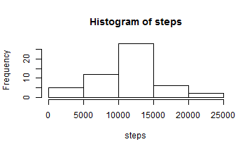
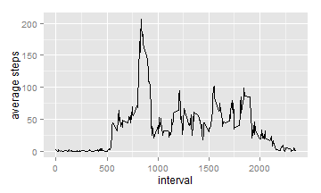
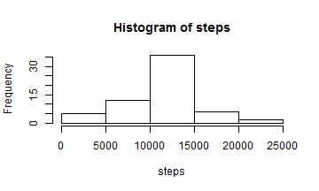

```r
#setwd("C:/Users/Xin/Dropbox/Courses/Reproducible Research")
dt<-read.csv("activity.csv")
```


What is mean total number of steps taken per day?
---


```r
require(sqldf)
```

```
## Loading required package: sqldf
## Loading required package: gsubfn
## Loading required package: proto
## Loading required package: RSQLite
## Loading required package: DBI
```

```r
#colnames(dt)
#str(dt$date)

c<-sqldf("select distinct date,sum(steps) as totSteps from dt group by date") 
```

```
## Loading required package: tcltk
```

```r
steps<-as.numeric(c$totSteps)
hist(steps)
```

 

```r
#Median steps each day
median(steps,na.rm = TRUE)
```

```
## [1] 10765
```

```r
#Mean steps each day
mean(steps,na.rm = TRUE)
```

```
## [1] 10766.19
```


What is the average daily activity pattern?
---


```r
a<-aggregate(dt, by=list(dt$interval), FUN=mean, na.rm=TRUE)
require(ggplot2)
```

```
## Loading required package: ggplot2
```

```r
qplot(a$interval,a$steps,a,geom = "path",xlab ='interval',ylab='average steps')
```

 

```r
a2<- a[order(-a$steps),] 
```
The interval with max average steps is

```r
a2$interval[1]
```

```
## [1] 835
```
The max average step is:

```r
a2$steps[1]
```

```
## [1] 206.1698
```


Imputing missing values  
---
**The imputation is based on interval average across all days**


```r
tot_missing<-sum(is.na(dt$steps))
tot_missing
```

```
## [1] 2304
```

```r
#imput by interval average
dt2<-sqldf("select dt.*,a.steps as m from dt left join a on dt.interval=a.interval")

for (i in 1:length(dt2$steps)){
  if(is.na(dt2$steps[i])){dt2$steps[i]<-dt2$m[i]}
}

c<-sqldf("select distinct date,sum(steps) as totSteps from dt2 group by date") 
steps<-as.numeric(c$totSteps)
hist(steps)
```

 

```r
#Median steps each day
median(steps,na.rm = TRUE)
```

```
## [1] 10766.19
```

```r
#Mean steps each day
mean(steps,na.rm = TRUE)
```

```
## [1] 10766.19
```
**This results is slightly different with the raw data statistics. After imputing missing value with average interval steps, mean and median are equal. The data show less bias. **


Are there differences in activity patterns between weekdays and weekends?
---


```r
dt2$weekday<-ifelse(
   (weekdays(as.Date(dt2$date)) %in% c("Saturday","Sunday")),"weekend","weekday")
a<-aggregate(dt2, by=list(dt2$interval,dt2$weekday), FUN=mean, na.rm=TRUE)
colnames(a)<-c("interval","weekday","steps","v1","v2")


library(lattice) 
xyplot(a$steps~a$interval|a$weekday,xlab="Interval",ylab="Number of steps",layout=c(1, 2),main="",type=c("l"))
```

 
