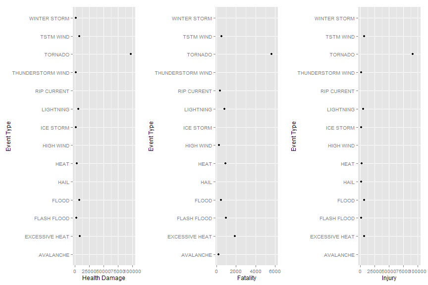

Data Processing
---

```r
library(ggplot2)
library(sqldf)
#read in data
setwd("C:/Users/xin/Dropbox/Courses/Reproducible Research")
      
raw<-read.csv("repdata-data-StormData.csv.bz2")
#subset
#c(COUNTY_END,COUNTYENDN,END_RANGE,END_AZI,END_LOCATI,STATEOFFIC,ZONENAMES,LATITUDE_E,LONGITUDE_,REMARKS)
raw1<-subset(raw,select=c(BGN_DATE,STATE,EVTYPE,FATALITIES,INJURIES,PROPDMG,CROPDMG,CROPDMGEXP,PROPDMGEXP,LATITUDE,LONGITUDE,REFNUM))
rm(raw)

#reshape date
library(lubridate)
x1<-strsplit(as.character(raw1$BGN_DATE)," ")
x2<-mdy(unlist(x1))
```

```
## Warning: 902297 failed to parse.
```

```r
x2<-x2[!is.na(x2)]
raw1$Date<-x2
storm<-subset(raw1,select=-c(BGN_DATE))
rm(raw1)

#a2<-subset(storm,select=c(EVTYPE,FATALITIES,INJURIES,PROPDMG,CROPDMG))
#library("plyr")
#a3<-ddply(a2, .(EVTYPE), colwise(sum))
#a4<-sqldf("select * from a3 order by CROPDMG+PROPDMG")


transf<-function(x){
  if (x=='B'){y=1000000000}
  else if (x=='M'){y=1000000}
  else if (x=='K'){y=1000}
  else {y=1}
  y
}
storm$x<-lapply(storm$CROPDMGEXP,function(x) transf(x))
storm$y<-lapply(storm$PROPDMGEXP,function(x) transf(x))
storm$x<-unlist(storm$x)
storm$y<-unlist(storm$y)
storm$Crop<-storm$CROPDMG*storm$x
storm$Prop<-storm$PROPDMG*storm$y
Pop<-sqldf("select distinct EVTYPE, sum(FATALITIES) as TotFata, sum(INJURIES) as TotInju,sum(FATALITIES)+sum(INJURIES) as HelDam from storm group by EVTYPE")

Eco<-sqldf("select distinct EVTYPE, sum(Prop)    as TotProp, sum(Crop)  as TotCrop, sum(Prop)+sum(Crop) as EcoDam from storm group by EVTYPE")
```

Result
---

Chart1.Tornado--the event that is the most harmful to population health  
---
Tornado costed the highest damage no mater how we measure the healthy damage.   


```r
#select top 1 % to make a clear plot
quantile(Pop$HelDam, probs = c(0.99,1), na.rm = TRUE)
```

```
##      99%     100% 
##  1407.72 96979.00
```

```r
quantile(Pop$TotFata, probs =c(0.99,1), na.rm = TRUE)
```

```
##     99%    100% 
##  208.88 5633.00
```

```r
quantile(Pop$TotInju, probs = c(0.99,1), na.rm = TRUE)
```

```
##     99%    100% 
##  1327.4 91346.0
```

```r
Pop1<-sqldf("select * from Pop where HelDam>=1407.72 or TotFata>=208.88 or TotInju>=1327.4")
```
**Plot for events that have top 1% damage power regarding fatality, injury, and total health damage(fatality and injury combined).**

```r
library(ggplot2)
q1<-qplot(HelDam,EVTYPE,data=Pop1)+xlim(1407,100000)+ylab("Event Type")+xlab("Health Damage")
q2<-qplot(TotFata,EVTYPE,data=Pop1)+xlim(208,6000)+ylab("Event Type")+xlab("Fatality")
q3<-qplot(TotInju,EVTYPE,data=Pop1)+xlim(1327,100000)+ylab("Event Type")+xlab("Injury")
require(gridExtra)
grid.arrange(q1, q2,q3, ncol=3)
```

 

Chart2. Flood, Huricane/Typhoon and Tornado--the events have the greatest economic consequences     
---
**Flood has the highest economic damage as well as the No 1 cause of property damage**  
**DROUGHT caused the most server crop damage.**


```r
#select top 1 % to make a clear plot
quantile(Eco$EcoDam, probs = c(0.99,1), na.rm = TRUE)
```

```
##          99%         100% 
##   8475805320 150319678257
```

```r
quantile(Eco$TotProp, probs =c(0.99,1), na.rm = TRUE)
```

```
##          99%         100% 
##   5143121627 144657709807
```

```r
quantile(Eco$TotCrop, probs = c(0.99,1), na.rm = TRUE)
```

```
##         99%        100% 
##   791109592 13972566000
```

```r
Eco1<-sqldf("select * from Eco where EcoDam>=8475805320 or TotProp>=5143121627 or TotCrop>=791109592")
Eco2<-Eco1[order(-Eco1$EcoDam),]
```
**Plot for events that have top 1% damage power regarding property damage, crop damage, and total economic damage(crop and property combined).**

```r
q1<-qplot(EcoDam,EVTYPE,data=Eco1)+xlim(8382236550 ,150319678257)+ylab("Event Type")+xlab("Economic Damage")
q2<-qplot(TotProp,EVTYPE,data=Eco1)+xlim(8382236550 ,150319678257)+ylab("Event Type")+xlab("Property Damage")
q3<-qplot(TotCrop,EVTYPE,data=Eco1)+xlim(8382236550 ,150319678257)+ylab("Event Type")+xlab("Crop Damage")
q3<-qplot(TotCrop,EVTYPE,data=Eco1)+xlim(1094086000,13972566000)+ylab("Event Type")+xlab("Crop Damage")
grid.arrange(q1, q2,q3, ncol=3)
```

 


Chart3, show the economic damage by state
---

```r
suppressPackageStartupMessages(library(googleVis))
library(googleVis)
op <- options(gvis.plot.tag='chart')
library(sqldf)
G1<-sqldf("select distinct STATE,sum(Prop)+sum(Crop) as EcoDam from storm group by STATE ")


GeoStates <- gvisGeoChart(data=G1, locationvar="STATE", colorvar="EcoDam",
                          options=list(region="US", 
                                       displayMode="regions", 
                                       resolution="provinces",
                                       width=600, height=400))
GeoStates
```

<!DOCTYPE html PUBLIC "-//W3C//DTD XHTML 1.0 Strict//EN"
  "http://www.w3.org/TR/xhtml1/DTD/xhtml1-strict.dtd">
<html xmlns="http://www.w3.org/1999/xhtml">
<head>
<title>GeoChartID318c2c3e7a63</title>
<meta http-equiv="content-type" content="text/html;charset=utf-8" />
<style type="text/css">
body {
  color: #444444;
  font-family: Arial,Helvetica,sans-serif;
  font-size: 75%;
  }
  a {
  color: #4D87C7;
  text-decoration: none;
}
</style>
</head>
<body>
 <!-- GeoChart generated in R 3.1.3 by googleVis 0.5.8 package -->
<!-- Thu Apr 16 22:32:36 2015 -->


<!-- jsHeader -->
<script type="text/javascript">
 
// jsData 
function gvisDataGeoChartID318c2c3e7a63 () {
var data = new google.visualization.DataTable();
var datajson =
[
 [
 "AK",
297956490 
],
[
 "AL",
17818231180 
],
[
 "AM",
5703800 
],
[
 "AN",
294000 
],
[
 "AR",
4557096380 
],
[
 "AS",
199823000 
],
[
 "AZ",
3960530680 
],
[
 "CA",
127115859400 
],
[
 "CO",
2889950125 
],
[
 "CT",
761571250.8 
],
[
 "DC",
157819100 
],
[
 "DE",
179028920 
],
[
 "FL",
45412969880 
],
[
 "GA",
6017502836 
],
[
 "GM",
3603040 
],
[
 "GU",
1054208000 
],
[
 "HI",
220164440 
],
[
 "IA",
10186592410 
],
[
 "ID",
267452060 
],
[
 "IL",
14087441740 
],
[
 "IN",
4890514985 
],
[
 "KS",
5054720600 
],
[
 "KY",
3038386553 
],
[
 "LA",
61301711690 
],
[
 "LC",
0 
],
[
 "LE",
30000 
],
[
 "LH",
0 
],
[
 "LM",
2632100 
],
[
 "LO",
70000 
],
[
 "LS",
4e+05 
],
[
 "MA",
1280205525 
],
[
 "MD",
1300356920 
],
[
 "ME",
562259500 
],
[
 "MH",
5e+06 
],
[
 "MI",
2685481986 
],
[
 "MN",
5701545860 
],
[
 "MO",
7931827188 
],
[
 "MS",
36418939770 
],
[
 "MT",
405269850 
],
[
 "NC",
10283557430 
],
[
 "ND",
5865895673 
],
[
 "NE",
5294990407 
],
[
 "NH",
220418770 
],
[
 "NJ",
3295211200 
],
[
 "NM",
1980592380 
],
[
 "NV",
840769185 
],
[
 "NY",
4971831180 
],
[
 "OH",
7250300733 
],
[
 "OK",
6719687080 
],
[
 "OR",
1065153945 
],
[
 "PA",
5423437452 
],
[
 "PH",
0 
],
[
 "PK",
31000 
],
[
 "PM",
0 
],
[
 "PR",
2869651590 
],
[
 "PZ",
76000 
],
[
 "RI",
120646025 
],
[
 "SC",
1258440950 
],
[
 "SD",
852117905.2 
],
[
 "SL",
15000 
],
[
 "ST",
0 
],
[
 "TN",
6583044719 
],
[
 "TX",
33942438130 
],
[
 "UT",
798150520.8 
],
[
 "VA",
2531848055 
],
[
 "VI",
39777300 
],
[
 "VT",
1538108300 
],
[
 "WA",
1412768280 
],
[
 "WI",
4202685880 
],
[
 "WV",
1026590023 
],
[
 "WY",
212120570 
],
[
 "XX",
0 
] 
];
data.addColumn('string','STATE');
data.addColumn('number','EcoDam');
data.addRows(datajson);
return(data);
}
 
// jsDrawChart
function drawChartGeoChartID318c2c3e7a63() {
var data = gvisDataGeoChartID318c2c3e7a63();
var options = {};
options["width"] =    600;
options["height"] =    400;
options["region"] = "US";
options["displayMode"] = "regions";
options["resolution"] = "provinces";

    var chart = new google.visualization.GeoChart(
    document.getElementById('GeoChartID318c2c3e7a63')
    );
    chart.draw(data,options);
    

}
  
 
// jsDisplayChart
(function() {
var pkgs = window.__gvisPackages = window.__gvisPackages || [];
var callbacks = window.__gvisCallbacks = window.__gvisCallbacks || [];
var chartid = "geochart";
  
// Manually see if chartid is in pkgs (not all browsers support Array.indexOf)
var i, newPackage = true;
for (i = 0; newPackage && i < pkgs.length; i++) {
if (pkgs[i] === chartid)
newPackage = false;
}
if (newPackage)
  pkgs.push(chartid);
  
// Add the drawChart function to the global list of callbacks
callbacks.push(drawChartGeoChartID318c2c3e7a63);
})();
function displayChartGeoChartID318c2c3e7a63() {
  var pkgs = window.__gvisPackages = window.__gvisPackages || [];
  var callbacks = window.__gvisCallbacks = window.__gvisCallbacks || [];
  window.clearTimeout(window.__gvisLoad);
  // The timeout is set to 100 because otherwise the container div we are
  // targeting might not be part of the document yet
  window.__gvisLoad = setTimeout(function() {
  var pkgCount = pkgs.length;
  google.load("visualization", "1", { packages:pkgs, callback: function() {
  if (pkgCount != pkgs.length) {
  // Race condition where another setTimeout call snuck in after us; if
  // that call added a package, we must not shift its callback
  return;
}
while (callbacks.length > 0)
callbacks.shift()();
} });
}, 100);
}
 
// jsFooter
</script>
 
<!-- jsChart -->  
<script type="text/javascript" src="https://www.google.com/jsapi?callback=displayChartGeoChartID318c2c3e7a63"></script>
 
<!-- divChart -->
  
<div id="GeoChartID318c2c3e7a63" 
  style="width: 600; height: 400;">
</div>
 <div><span>Data: G1 &#8226; Chart ID: <a href="Chart_GeoChartID318c2c3e7a63.html">GeoChartID318c2c3e7a63</a> &#8226; <a href="https://github.com/mages/googleVis">googleVis-0.5.8</a></span><br /> 
<!-- htmlFooter -->
<span> 
  R version 3.1.3 (2015-03-09) 
  &#8226; <a href="https://developers.google.com/terms/">Google Terms of Use</a> &#8226; <a href="https://google-developers.appspot.com/chart/interactive/docs/gallery/geochart">Documentation and Data Policy</a>
</span></div>
</body>
</html>

```r
#plot(GeoStates) does not work
#add results='asis',otherwise no graph
#googlevis graph shows in the browser,but not in the rstudio preview
#motion chart won't work in IE 11. Oh, BOTHER!!
```

